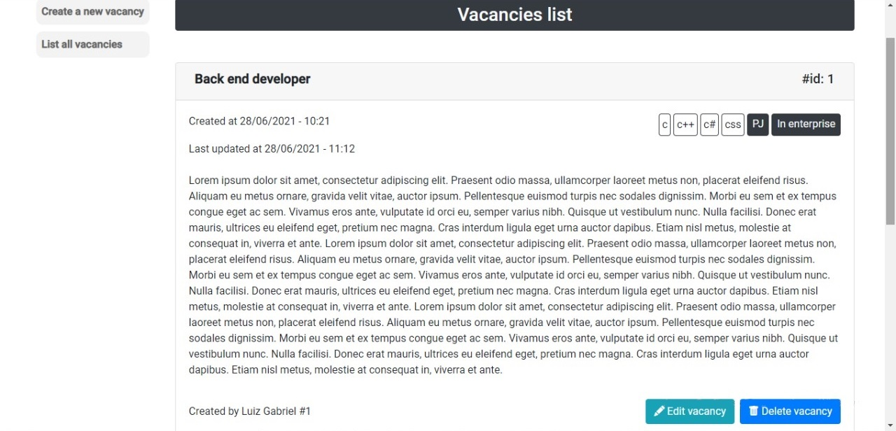

# Welcome to Human Resources (Client Application)

### Project status

    

### Index

1. [Abstract](#abstract)
2. [Client App Views](#clientAppViews)
	1. [Public Routes](#publicRoutes)
		1. [Login Route](#loginRoute)
		2. [Candidate Register](#candidateRegister)
	2. [Private Routes](#privateRoutes)
		1. [Candidate Routes](#candidateRoutes)
		2. [Admin Routes](#adminRoutes)
3. [About Angular](#aboutAngular)
4. [About Laravel API](#aboutLaravelAPI)
5. [About MySQL](#aboutMySQLCommunity)
6. [Third Party Resources](#thirdPartyResources)

### 1. Abstract <a name="abstract">

Currently, the market demand by web developers pass by a high climax. Programmers that have skills in web development, API consume, experience in increment and fixing web systems are recruited for participate in selective and hiring processes. That project was designed to demonstrate important development concepts using Angular framework, JS, HTML and CSS languages, MySQL database, a Laravel API and outher third-part dependencies. The employed methodology to develope this site was Angular documentation reading and searchs on StackOverflow website to solve doubts. Human resources consume JSON data format and implements methods to image upload, authentication (protected routes), data pagination, admins management and multiple CRUD's. The project results are very satisfying and objectivies are all goals have been achieved. 

### 2. Client App Views <a name="clientAppViews">

### 2.1 Public Routes <a name="publicRoutes">

### 2.1.1 Login Route <a name="loginRoute">

Candidates and admins can login using same page, however Admin users should click in checkbox indicating that is admin.

### 2.1.2 Candidate Register <a name="candidateRegister">

### 2.2 Private Routes <a name="privateRoutes">

### 2.2.1 Candidate Routes <a name="candidateRoutes">

### 2.2.2 Admin Routes <a name="adminRoutes">

### 3. About Angular <a name="aboutAngular">

### 4. About Laravel API <a name="aboutLaravelAPI">

The API developed for this project can be seen at: [Go to Laravel API](https://github.com/NewDevBr/HumanResourcesLaravelAPI)

Laravel is a web application framework with expressive, elegant syntax. We believe development must be an enjoyable and creative experience to be truly fulfilling. Laravel takes the pain out of development by easing common tasks used in many web projects, such as:

- [Simple, fast routing engine](https://laravel.com/docs/routing).
- [Powerful dependency injection container](https://laravel.com/docs/container).
- Multiple back-ends for [session](https://laravel.com/docs/session) and [cache](https://laravel.com/docs/cache) storage.
- Expressive, intuitive [database ORM](https://laravel.com/docs/eloquent).
- Database agnostic [schema migrations](https://laravel.com/docs/migrations).
- [Robust background job processing](https://laravel.com/docs/queues).
- [Real-time event broadcasting](https://laravel.com/docs/broadcasting).

Laravel is accessible, powerful, and provides tools required for large, robust applications.

\* The text above was automatically generated by laravel

### 5. About MySQL <a name="aboutMySQLCommunity">

MySQL is a Database Management System (DMS), based on structured tables and entities relationship. This is the most famous database, maintained by Oracle according to Stack Overflow (SO) Survey 2020 [SO survey](https://insights.stackoverflow.com/survey/2020#technology-databases-all-respondents4). Software version used to construct it was MySQL Community version, available to download in: [MySQL Community Downloads](https://dev.mysql.com/downloads/)

### 6. Third Party Resources <a name="thirdPartyResources">
